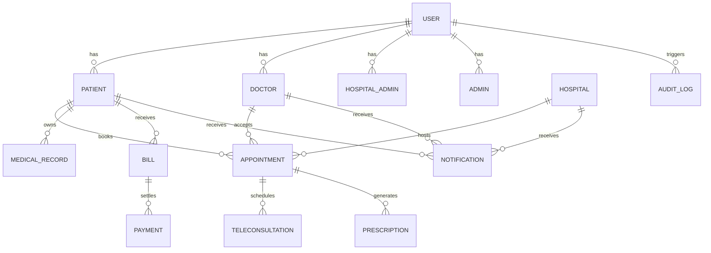

# UPCHAR Phase 1 Architecture

## Objective
Build the architecture foundation for UPCHAR as an Azure AKS-ready healthcare platform with domain-driven service boundaries, repeatable infrastructure, and a delivery blueprint.

## Domain Boundaries
- Public website
- Patient experience
- Doctor experience
- Hospital operations
- Admin and trust operations
- Platform services (authentication, gateway, search, notifications, analytics)

## Service Map
- API Gateway: single entry point for web/mobile clients
- Authentication Service: JWT, OAuth, Google Sign-In, OTP, MFA-ready, refresh token rotation
- User Service: profile, patient, doctor, hospital, roles, permissions
- Doctor Service: doctor roster, specialties, schedule availability
- Hospital Service: hospital profile, departments, staff, facilities
- Appointment Service: booking, reschedule, cancellation, availability
- Telemedicine Service: consultation session metadata, video call orchestration
- Medical Records Service: secure record storage, upload metadata, audit
- Pharmacy Service: catalog, order lifecycle, inventory pointers
- Billing Service: payments, invoices, wallet, subscriptions
- Notification Service: email/SMS/push events and async delivery
- Search Service: Elasticsearch-oriented query and suggestions
- Analytics Service: business metrics, event capture, KPI aggregation

## High-Level Architecture
- Web platform apps use Next.js + React + Tailwind + TypeScript
- Mobile app uses React Native
- Backend services use Node.js + NestJS + Express
- Databases: PostgreSQL for transactional domain data, Redis for caching and sessions, Elasticsearch for search
- Azure infrastructure via Terraform and AKS
- GitHub Actions for CI and ArgoCD for GitOps deployment
- Observability via Prometheus, Grafana, ELK, Azure Monitor

## ERD (Phase 1 subset)

## DevOps Blueprint
- Infrastructure as code in `infra/terraform`
- AKS manifests and Helm charts in `infra/aks` and `infra/helm`
- ArgoCD app-of-apps scaffolding in `infra/argocd`
- Monitoring stack in `infra/monitoring`
- Environment separation: dev, staging, prod
- GitHub Actions: lint/test/build/publish/deploy
- Secrets strategy: Azure Key Vault and Kubernetes Secret references
- Cluster resilience: multi-zone AKS node pools, node taints, pod disruption budgets, autoscaling

## Phase 1 Deliverables
- Monorepo folder architecture
- Service README scaffolds
- System architecture docs
- ERD and domain boundaries
- DevOps and GitOps blueprint
- Project-level production readiness guidance
